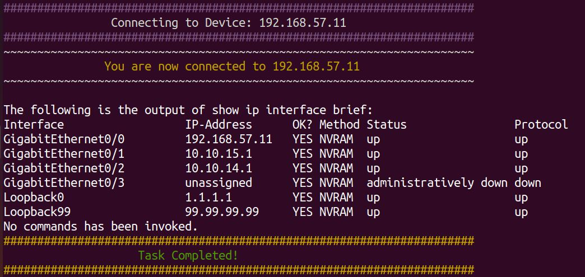
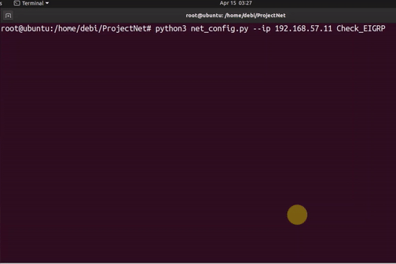
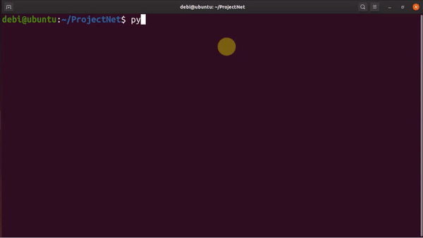

# Click_NetMiko 
[](https://developer.cisco.com/codeexchange/github/repo/NetworkGirlDebi/Netmiko)

## Code Features
```
Integrating Click you can have the following at the CLI...

* Prompt user for username and password
* Entering options and commands to on command line
-- Option for entering an IP address
-- Option for entering device type
-- Option for opening text file with configurations
-- Option for opening text file with list of devices
-- Option for entering a show command
-- Commands for checking EIGRP and OSPF
```

## Netmiko
Multi-vendor library to simplify Paramiko SSH connections to network devices. See [Netmiko](https://github.com/ktbyers/netmiko), for more info.

## Click
Click is a Python package for creating beautiful command line interfaces in a composable way with as little code as necessary. It’s the “Command Line Interface Creation Kit”. See [Click](https://click.palletsprojects.com/en/7.x/), for more info.

## Video
This code is from one of my videos on YouTube "Click_NetMiko".

[](http://www.youtube.com/watch?v=FlP2eJ8FqoE "Click_NetMiko")


## Getting Started
For setting up the network environment, please see this video [Setting Up My Network Automation Environment!](https://youtu.be/3ZrkQK3aEIE)

### Install the code requirements
```
pip install -r requirements.txt
```
### Local Code
All of the code and examples for this are located in this directory. 
Clone to access it with the following commands on your local machine.
```
git clone https://github.com/NetworkGirlDebi/Click_NetMiko/tree/master/NetProject.git
cd NetProject
```

### Local Python Environment Setup
It is recommended that this demo be completed using Python 3.8.

If you are not using a virtual machine, it is recommended to enable the virtual environment for the working directory.
```
#For OS X or Linux
pip install virtualenv
virtualenv {name_of_your_working_directory} --python=python3.8
source {name_of_your_working_directory}/bin/activate

#For Windows
pip install venv
py -3 -m venv {name_of_your_working_directory}
source {name_of_your_working_directory}/Scripts/activate
```

## Example of use
_please note the ip address should be changed to your target ip, as well as the username and password_
```
python3 net_config.py --ip 192.168.57.11 --cmd "show ip interface brief"
```


```
python3 net_config.py --ip 192.168.57.11 Check_EIGRP
```


### Other Cli options and commands
_please remember to change the target ip or file name to your own, as well as the username and password_
```
python3 net_config.py --ip 192.168.57.11 --cmd "show run"
python3 net_config.py --ip 192.168.57.11 --config config_LO99
python3 net_config.py --ip 192.168.57.11 --config config_motd
python3 net_config.py --ip 192.168.57.11 Check_OSPF

python3 net_config.py --device_list devices --cmd "show ip interface brief"
python3 net_config.py --device_list devices --cmd "show run"
python3 net_config.py --device_list devices --config config_LO99
python3 net_config.py --device_list devices --config config_motd
python3 net_config.py --device_list devices  Check_OSPF
python3 net_config.py --device_list devices  Check_EIGRP
```
## Save Show Command to file
When show command is entered, the user will be prompted whether to save the output of the show command.

_please remember to change the target ip or file name to your own, as well as the username and password_
```
python3 net_config.py --ip 192.168.57.11 --cmd "show ip interface brief"
```


### Source
The check_ospf command is from IPvZero. See the script on [his github](https://github.com/IPvZero/IPvZero/tree/master/Netmiko-video).

## About Me

* Never worked in the IT industry, but always fastinatied by the evolving new technologies.
* Now in my final year of my honours degree in Cyber Security and Networks
* Interests in NetDevOps, Automation, Programmability, Security.

Follow me on [Twitter](https://twitter.com/Debi_ASY) | [YouTube](https://www.youtube.com/channel/UC0xrmfrXnxrw8ClTsa32LcQ) | [LinkedIn](https://www.linkedin.com/in/dasy225/)

